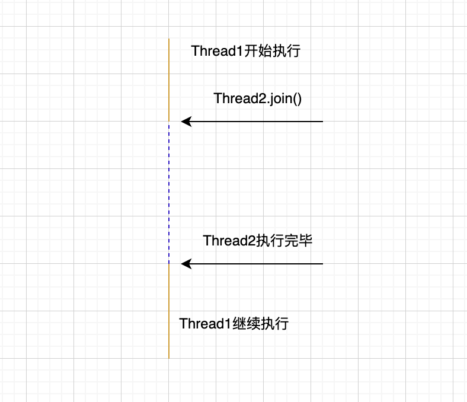

## 创建线程的方式

### 方式一：继承Thread类

```java
/**
 * 使用继承java.lang.Thread类的方式创建一个线程
 */
public class ThreadTest extends Thread {
    @Override
    public void run() {
        System.out.println("I'm running!");
    }
}
```

**线程运行**

任何一个线程的执行的前提都是必须有Thread class的实例存在，并且通过调用start()方法启动线程。

```java
ThreadTest tt = new ThreadTest();
tt.start();
```

> 一个Thread的实例，只能调用一次start()方法，二次调用会抛异常

**Thread类常用方法**

**`yield()`**

暂停当前线程，以便其他线程有机会执行，即将Running状态转变为Runnable状态

```java
public class ThreadTest extends Thread {
    @Override
    public void run() {
        for(int i = 0; i < 100; i++) {
          System.out.println("I'm running! " + i);
          if(i % 10 == 0) {
            yield();
          }
        }
    }
}
```

**`join()`**

等待该线程终止。在线程A中调用线程B的join()，此时A进入阻塞状态，直到线程B执行完毕，线程A才结束阻塞状态，变为就绪状态，等待CPU的调用。

使用场景：

主线程生成并起动了子线程，如果子线程里要进行大量的耗时的运算，主线程往往将于子线程之前结束，但是如果主线程处理完其他的事务后，需要用到子线程的处理结果，也就是主线程需要等待子线程执行完成之后再结束，这个时候就要用到join()方法了。

逻辑如图所示：



```java
public static void main() {
  ThreadTest tt = new ThreadTest();
	tt.start();
  
  for(int i = 0; i < 100; i++) {
    System.out.println("main running! " + i);
    if(i % 10 == 0) {
      // 等待tt执行完毕，主线程才会继续向下执行
      tt.join();
    }
  }
}
```

**join源码**

```java
public final synchronized void join(long millis) //参数millis为0.  
throws InterruptedException {
    long base = System.currentTimeMillis();
    long now = 0;
    if (millis < 0) {
        throw new IllegalArgumentException("timeout value is negative");
    }
    if (millis == 0) { //进入这个分支  
        while (isAlive()) { //判断本线程是否为活动的
            wait(0); //阻塞  
        }
    } else {
        while (isAlive()) {
            long delay = millis - now;
            if (delay <= 0) {
                break;
            }
            wait(delay);
            now = System.currentTimeMillis() - base;
        }
    }
}
```

通过源码我们可以看到，判断另一个线程是否结束是通过调用`isAlive`方法获取的。

## 方式二：实现Runnable接口

```
public class ThreadDemo1 implements Runnable {
    private int countDown = 10;
    
    @Override
    public void run() {
        while(countDown-- >0)
        {
            System.out.println("$" + Thread.currentThread().getName() 
                    + "(" + countDown + ")");
        }
    }

    public static void main(String[] args) {
        Runnable demo1 = new ThreadDemo1();
        
        Thread thread1 = new Thread(demo1);
        thread1.setName("Thread-0");
        Thread thread2 = new Thread(demo1);
        thread2.setNmae("Thread-1")
        thread1.start();
        thread2.start();
        
        System.out.println("火箭发射倒计时:");
    }
}
```

程序运行结果

火箭发射倒计时:
$Thread-0(9)
$Thread-1(8)
$Thread-0(7)
$Thread-1(6)
$Thread-0(5)
$Thread-1(4)
$Thread-0(3)
$Thread-1(2)
$Thread-0(1)
$Thread-1(0)

看出差别了没有，两个线程共同countDown变量。使用此种方式，可以多个线程共享同一个目标对象，所以非常适合多个相同线程来处理同一份资源的情况，从而可以将CPU代码和数据分开，形成清晰的模型，较好地体现了面向对象的思想。

